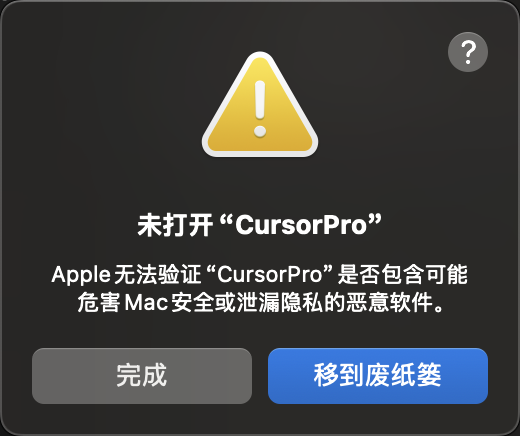

# Cursor Pro 自动化工具使用说明

## 功能介绍
自动注册账号，自动刷新本地token，解放双手。

## 下载地址
https://github.com/chengazhen/cursor-auto-free/releases

## 重要提示
**1.确保你有一个chrome浏览器；如果你没有；[下载地址](https://www.google.com/intl/en_pk/chrome/)**

**2.首先，你要自己已经登录过账号不管你的账号是不是有效，登录是必须的。**

**3.有一个稳定的网络连接。尽量是国外的节点。不要开启全局代理。一定不要开启全局代理。**

## 配置说明

+ 需要使用 cloudflare 域名邮箱，请自行搜索如何使用 cloudflare 域名邮箱，请自行搜索如何使用。
+ **（非常重要）** 需要使用 temp-mail.plus 邮箱，请自行搜索如何使用 temp-mail.plus 邮箱。
+ 将 cloudflare 的域名邮箱转发到 temp-mail.plus 邮箱。
+ 下载 .env.example 文件到程序所在根目录，并重命名为 .env 文件。


在使用之前，需要配置环境变量文件。

```bash
DOMAIN='xxxxx.me'    # 你的邮箱域名 自行搜索如何使用 cloudflare 邮箱
TEMP_MAIL='xxxxxx'   # 临时邮箱前缀，可以自定义，不需要后缀; 用的还是https://tempmail.plus/zh/#! 的邮箱
```

例如，如果你设置：
```bash
DOMAIN='wozhangsan.me'
TEMP_MAIL='ccxxxxcxx'
```
那么程序将随机生成 `@wozhangsan.me` 后缀作为注册邮箱。


## 运行方法

### Mac 版本
1. 打开终端，进入应用所在目录
2. 运行命令：授权文件可以执行
```bash
chmod +x ./CursorPro
```
3. 运行程序：
   - 在终端中运行：
```bash
./CursorPro
```
   - 或直接在访达（Finder）中双击运行


提示：如果遇到下面的问题; [解决方案](https://sysin.org/blog/macos-if-crashes-when-opening/)





### Windows 版本
直接双击运行 `CursorPro.exe`


## 如何验证是否有效
**运行脚本完成之后，重启你的编辑器，你会看到下面图片的账号和你的脚本输出的日志账号一致就搞定了。**


## 使用注意事项

1. 运行环境要求：
   - 稳定的网络连接
   - 足够的系统权限

2. 使用过程中：
   - 等待程序自动完成所有操作
   - 看到"脚本执行完毕"提示后再关闭程序

## 常见问题解决

1. 程序运行过程中卡住：
   - 检查网络连接
   - 重启程序重试


## 免责声明
本工具仅供学习研究使用，请遵守相关服务条款。使用本工具产生的任何后果由使用者自行承担。

## 更新日志
2025-01-09 增加了 log 日志，方便调试，增加了退出cursor，自动构建功能
2025-01-10 修改为使用 cloudflared 域名邮箱

仓库核心源码来自[gpt-cursor-auto](https://github.com/hmhm2022/gpt-cursor-auto)；自行优化了验证和邮箱注册逻辑；解决了无法获取邮箱验证码的问题。

